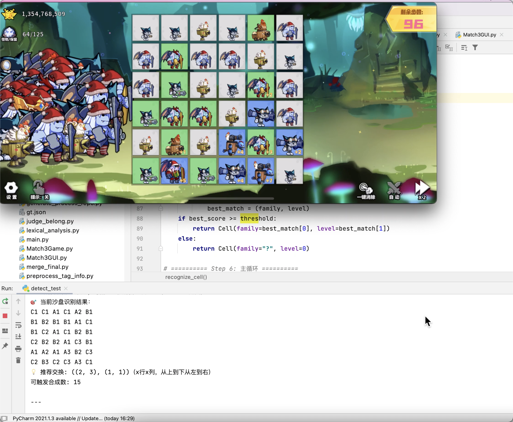

# 🧩《召唤与合成》消除辅助工具

这是一个针对手游《召唤与合成》（第一代）的消除辅助项目，复现了游戏的核心消除规则。  
通过图像识别+穷举，实时分析当前沙盘状态，并输出最佳交换点，帮助玩家更轻松地取得优势！

---

## 🚀 项目功能

- ✅ **复现游戏消除逻辑**：100%还原原作的核心合成规则
- 🧠 **智能穷举分析**：自动评估当前局面，找出最佳交换策略
- 🖼️ **图像识别支持**：实时识别游戏画面，获取沙盘数据
- 💻 **命令行输出结果**：即时反馈推荐交换点（无自动点击）

---
## 📸 运行示例

下面是本工具运行时的效果截图，展示了图像识别与推荐逻辑的实际表现：

---

## 🛠️ 使用说明

### 1. 环境要求

- 开发测试环境：**macOS + QuickTime Player**
- 数据来源：**iPhone画面镜像**
- ⚠️ *本工具不包含点击自动化功能，仅用于识别与提示*

### 2. 文件说明

| 文件/文件夹        | 说明                                             |
|--------------------|--------------------------------------------------|
| `templates/`       | 存放每个个体的截图，由 `screenShotHelper.py` 生成 |
| `Math3Game.py`     | 游戏的核心逻辑实现（合成/消除规则）              |
| `GameHelper.py`    | 图像识别功能 + 最佳交换点输出逻辑                |
| `screenShotHelper.py` | 从游戏画面生成截图模板                         |

---

## 🧪 如何运行

1. **准备图像模板**  
   运行 `screenShotHelper.py` 获取你当前游戏中使用的个体截图并存入 `templates/` 文件夹。

2. **识别并推荐操作**  
   运行 `GameHelper.py`，程序将自动识别游戏画面并在命令行中输出最佳交换位置。

---

## ❤️ 开源声明

欢迎感兴趣的小伙伴一起来完善这个项目！

- 👉 欢迎 `fork`、`star`、提交 `PR`
- 本项目仅为**学习交流用途**，请勿用于商业化或违反游戏条款的操作

---

## ⭐ Star 一下鼓励下作者吧！

> “如果你觉得项目有用，欢迎点个 Star！”